```{r setup, include=FALSE}
if (knitr:::is_html_output()) {
  knitr::opts_chunk$set(eval = FALSE)
}
```

# Using R in hydrology (EGU2017 short course)

*Instructors*: Shaun Harrigan, Katie Smith, Berry Boessenkool and Daniel Klotz  
*Organizer*: Berry Boessenkool, PhD student at Potsdam University (Germany)  
*Contact*: Questions and feedback are welcome via <berry-b@gmx.de>

These slides and all other course materials can be found at  
<font size="6">[github.com/brry/rhydro](https://github.com/brry/rhydro)</font>   
[Download the github course repository](https://github.com/brry/rhydro/archive/master.zip)
with all the materials including the datasets and presentation source code.  
This is an [R Markdown Notebook](http://rmarkdown.rstudio.com/r_notebooks.html).  
For discussions, please visit the 
[Hydrology in R Facebook group](https://www.facebook.com/groups/1130214777123909/).  
Before running the code blocks below, we suggest to get package installation instructions by running:
```R
source("https://raw.githubusercontent.com/brry/rhydro/master/checkpc.R")
```

\

**Aim and contents of this workshop**

We want to:  

* Show off how awesome R is for hydrology (it's R-some!^^)  
* Convince you to start or continue using R  
* Provide all the code for you as a starting point

We can not:  

* Teach you actual R coding (90 mins is too short for a tutorial)

We have prepared:

* [Good coding practice, report generation](#report) (Rstudio, `rmarkdown`, R notebook)
* [Using R as GIS](#gis) (reading a rainfall shapefile + Kriging, `sf` + `leaflet` + `mapview` + `OSMscale`)
* [River discharge time-series](#discharge) visualisation and extreme value statistics (`animation` + `extremeStat`)
* [Hydrological modelling](#hydmod) with `airGR`
* [Exploratory Data Analysis](#eda) including flow duration curve and trend analysis on time-series

\ 

Before we get started, please let us know your current R knowledge level by filling out the short survey at  
<font size="6">[bit.ly/knowR](https://bit.ly/knowR)</font> 

\

[top](#top)

# Report
Good coding practice, report generation (Rstudio, `rmarkdown`, R notebook)  
**Daniel Klotz**

### Why to use R


Why I did not use R: 

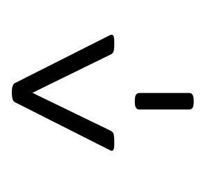


Whats great about R: 
```{r}
  library(ggplot2)
  test_data <- mpg
  test_plot <- ggplot(test_data, aes(displ, hwy, colour = class)) + 
    geom_point()
  test_plot
```

Why I decided to use R: 


Previously:
```{r}
  aggregation_function <- function(x) {
    round(mean(x),2)
  }
  mtcars_subset <- subset(mtcars,hp > 100)
  mtcars_aggregated <- aggregate(. ~ cyl, data = mtcars_subset, FUN = aggregation_function)
  car_data1 <- transform(mtcars_aggregated, kpl = mpg*0.4251)
  print(car_data1)
```

Now:
```{r}
library(magrittr)
car_data2 <- 
  mtcars %>%
  subset(hp > 100) %>%
  aggregate(. ~ cyl, data = ., FUN = . %>% mean %>% round(2)) %>%
  transform(kpl = mpg %>% multiply_by(0.4251)) %>%
  print
```


**btw:**
You can integrate other programming languages with ease. Here an example from 
[Yihui Xie](https://yihui.name/knitr/demo/engines/) for the use of `Fortran` 
in Rmarkdown:

1. Compile Code:
    ```{r compfort, engine='fortran', results='hide', eval=FALSE}
    C Fortran test
          subroutine fexp(n, x)
          double precision x
    C  output
          integer n, i
    C  input value
          do 10 i=1,n
             x=dexp(dcos(dsin(dble(float(i)))))
      10  continue
          return
          end
    ```

2. Run Code:
    ```{r testfort, collapse=TRUE, eval = FALSE}
    res = .Fortran("fexp", n=100000L, x=0)
    str(res)
    ```

Be happy with the result: 
>     `## List of 2`
>     `##  $ n: int 100000`
>     `##  $ x: num 2.72`

---

### Markdown 
HT**M**L: HyperText **Markdown** Language

John Gruber:

[](https://en.wikipedia.org/wiki/John_Gruber)


Comparison: Markdown vs. Latex 
[](https://youtu.be/2yvW0O_7xOg)


Rstudio provides cheat-sheets with the most important informations about many 
of their "favorite" packages & software:

[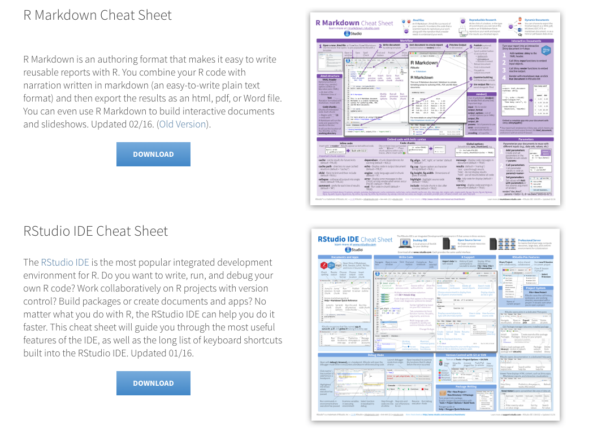](https://www.rstudio.com/resources/cheatsheets/)

** Rmarkdown **

In Rstudio: 

<div align="center">
  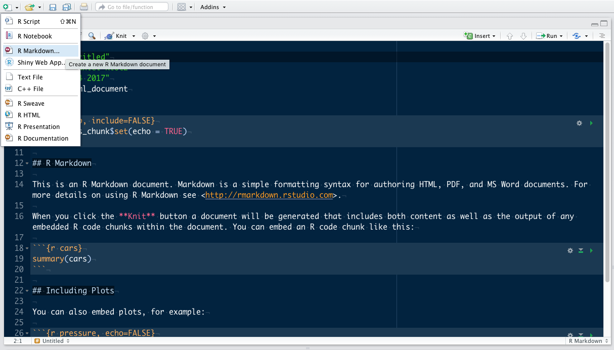
</div>

<div align="center">
  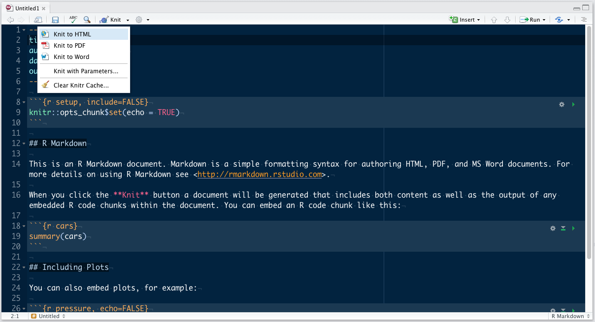
</div>

<div align="center">
  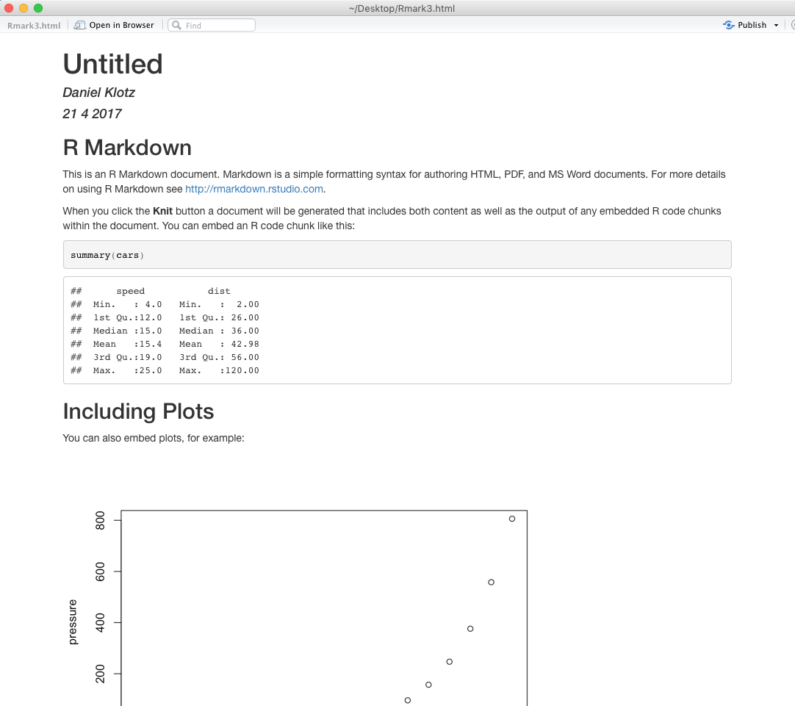
</div>

"Native" Formats:

- [html](daniel/show/Rmark.html) 
- [pdf](daniel/show/Rmark.pdf) 
- [word](daniel/show/Rmark.docs)

Much more possible if you adress pandoc directly: 
[](http://pandoc.org/)

Information in the text can be automatically updated with the rest of the 
document:
[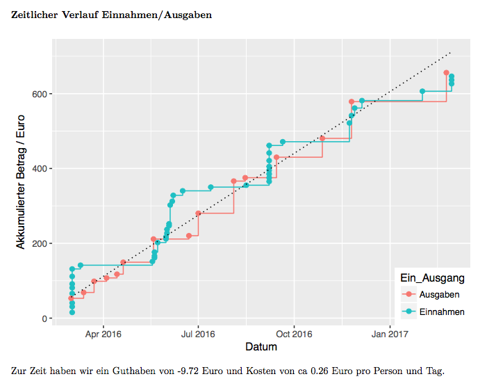

### Examples

#### Small Websites
<div align="center">
  <a href = "http://rstudio.github.io/tufte/">
    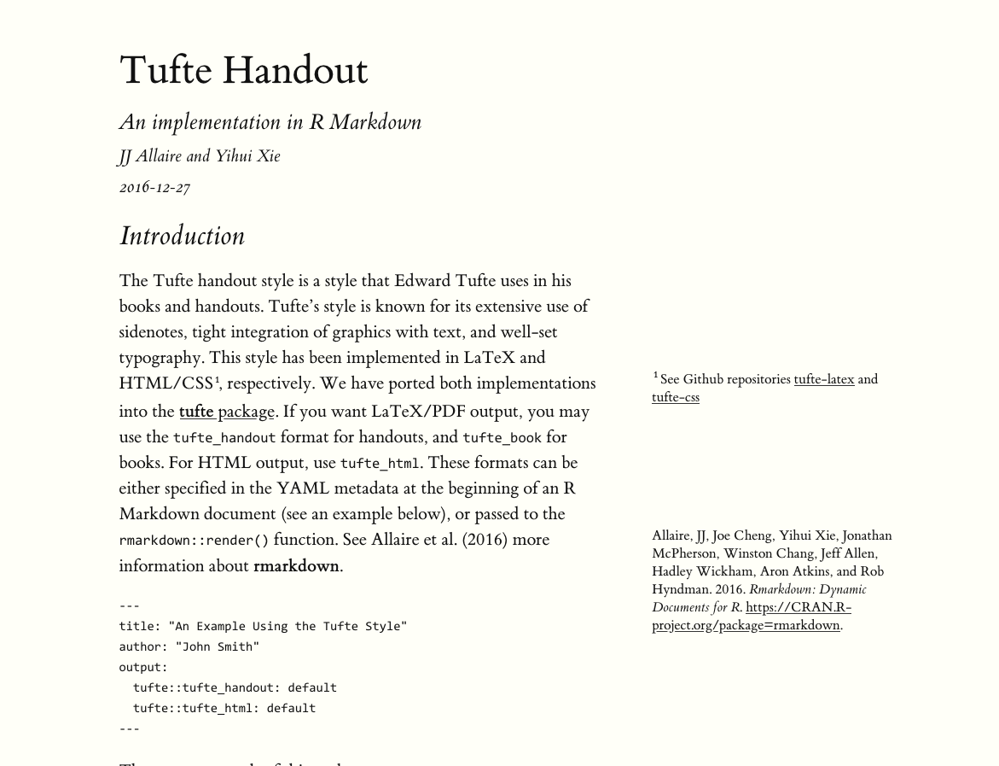
  </a>
</div>

<div align="center">
  <a href = "http://yixuan.cos.name/prettydoc/cayman.html">
    
  </a>
</div>

#### Books (blogdown)
[](https://bookdown.org/)
[](https://bookdown.org/)

#### Blogs (hugo)
[](https://bookdown.org/yihui/blogdown/)

#### Presentations
[](http://rmarkdown.rstudio.com/revealjs_presentation_format.html)

#### Widgets 
[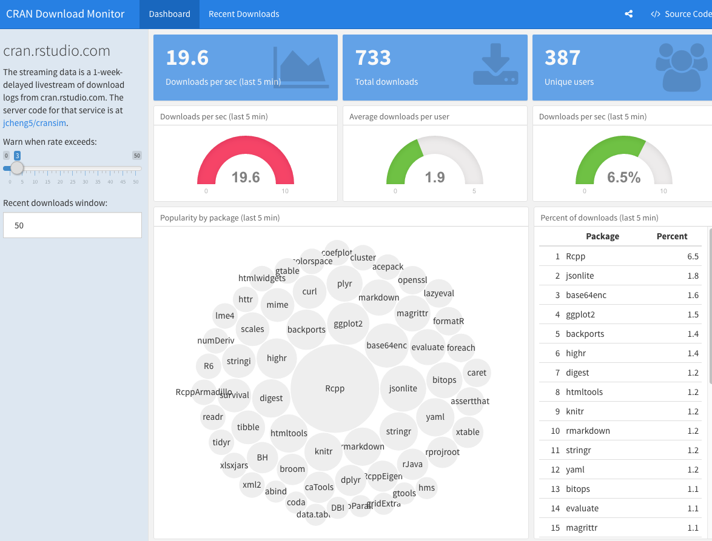](https://gallery.shinyapps.io/cran-gauge/)

#### Apps (Shiny) 
[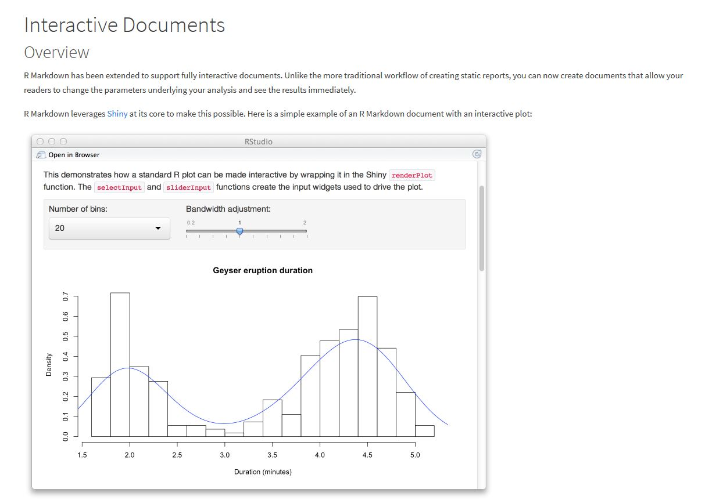](http://rmarkdown.rstudio.com/authoring_shiny.html)
[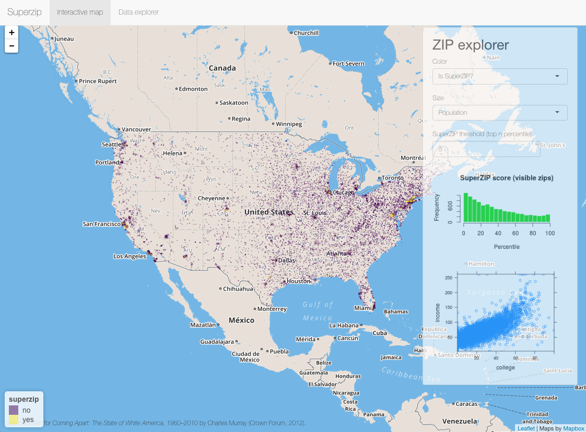](https://shiny.rstudio.com/gallery/superzip-example.html)
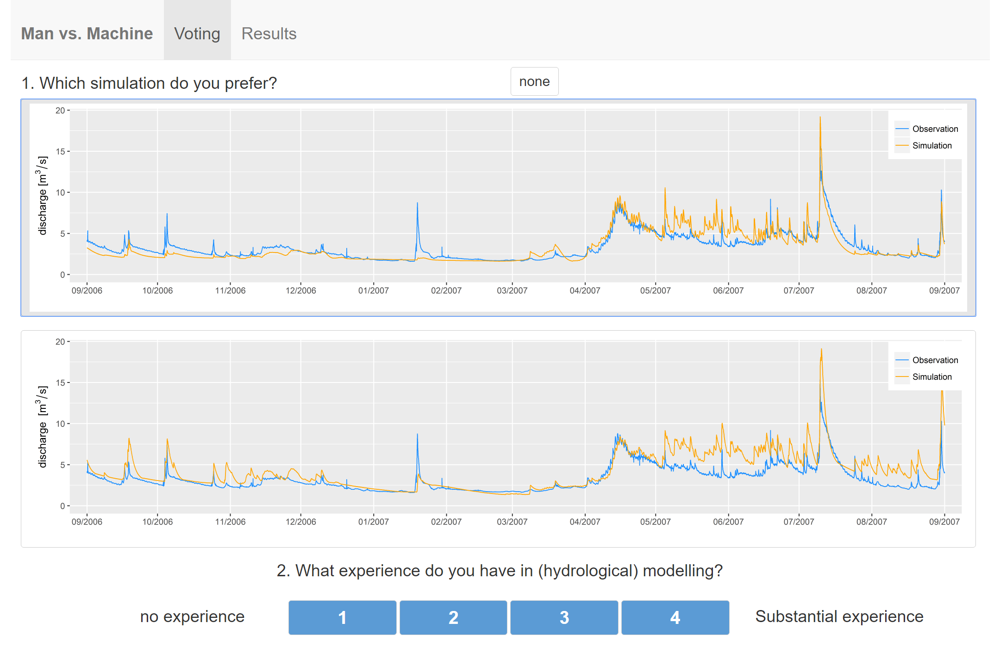


\
[top](#top)

# GIS
Using R as GIS (reading a rainfall shapefile + Kriging, `sf` + `leaflet` + `mapview` + `OSMscale`)  
**Berry Boessenkool**

### Shapefiles

Reading shapefiles with `maptools::readShapeSpatial` and `rgdal::readOGR` is obsolete.  
Instead, use `sf::st_read`. `sf` is on CRAN since oct 2016.  
Main reaction when using sf: "Wow, that is fast!"  
[Download the shapefile](https://minhaskamal.github.io/DownGit/#/home?url=https://github.com/brry/rhydro/tree/master/presentations/data/PrecBrandenburg) 
or better: [download the whole github course repository](https://github.com/brry/rhydro/archive/master.zip)

```{r}
rain <- sf::st_read("data/PrecBrandenburg/niederschlag.shp")
```

Central points of rainfall Thiessen polygons
```{r}
centroids <- sf::st_centroid(rain)
centroids <- sf::st_coordinates(centroids)
centroids <- as.data.frame(centroids)
```

[top](#top)

### Plotting, maps

Static plot:
```{r}
plot(rain[,1])
```

Static map:
```{r}
prj <- sf::st_crs(rain)$proj4string
cent_ll <- OSMscale::projectPoints(Y,X, data=centroids, to=OSMscale::pll(), from=prj)
#map_static <- OSMscale::pointsMap(y,x, cent_ll, fx=0.08, type="maptoolkit-topo", zoom=6)
#save(map_static, file="data/map_static.Rdata")
load("data/map_static.Rdata")
OSMscale::pointsMap(y,x, cent_ll, map=map_static)
```

Interactive map:
```{r}
library(leaflet)
cent_ll$info <- paste0(sample(letters,nrow(cent_ll),TRUE), ", ", round(cent_ll$x,2), 
                       ", ", round(cent_ll$y,2))
leaflet(cent_ll) %>% addTiles() %>% addCircleMarkers(lng=~x, lat=~y, popup=~info)
```

Interactive map of shapefile:
```{r}
# make sure to have installed the development version of mapview: 
# devtools::install_github("environmentalinformatics-marburg/mapview", ref = "develop")
library(berryFunctions) # classify, seqPal
col <- seqPal(n=100, colors=c("red","yellow","blue"))[classify(rain$P1)$index]
mapview::mapview(rain, col.regions=col)
```

[top](#top)

### Kriging

Plot original points colored by third dimension:
```{r}
pcol <- colorRampPalette(c("red","yellow","blue"))(50)
x <- centroids$X # use cent_ll$x for projected data
y <- centroids$Y
berryFunctions::colPoints(x, y, rain$P1, add=FALSE, col=pcol)
```

Calculate the variogram and fit a semivariance curve
```{r}
library(geoR)
geoprec <- as.geodata(cbind(x,y,rain$P1))
vario <- variog(geoprec, max.dist=130000) # other maxdist for lat-lon data
fit <- variofit(vario)
plot(vario)
lines(fit)
```

Determine a useful resolution 
(keep in mind that computing time rises exponentially with grid size)
```{r}
# distance to closest other point:
d <- sapply(1:length(x), function(i)
            min(berryFunctions::distance(x[i], y[i], x[-i], y[-i])) )
# for lat-long data use (2017-Apr only available in github version of OSMscale)
# d <- OSMscale::maxEarthDist(y,x, data=cent_ll, fun=min)
hist(d/1000, breaks=20, main="distance to closest gauge [km]")
mean(d/1000) # 8 km
```

Perform kriging on a grid with that resolution 
```{r}
res <- 1000 # 1 km, since stations are 8 km apart on average
grid <- expand.grid(seq(min(x),max(x),res),
                    seq(min(y),max(y),res))
krico <- krige.control(type.krige="OK", obj.model=fit)
#krobj <- krige.conv(geoprec, loc=grid, krige=krico)
#save(krobj, file="data/krobj.Rdata")
load("data/krobj.Rdata") # line above is too slow for recreation each time
```

Plot the interpolated values with `image` or an equivalent function 
(see [Rclick](https://github.com/brry/rclick) 4.15) and add contour lines.
```{r}
par(mar=c(0,3,0,3))
geoR:::image.kriging(krobj, col=pcol)
colPoints(x, y, rain$P1, col=pcol, legargs=list(horiz=F, title="Prec",y1=0.1,x1=0.9))
points(x,y)
plot(rain, col=NA, add=TRUE)
```
\
[top](#top)

# Discharge
River discharge time-series visualisation and extreme value statistics (`animation` + `extremeStat`)  
**Berry Boessenkool**

### Read, plot and aggregate data

Datasets from the UK National River Flow Archive
<http://nrfa.ceh.ac.uk/data/station/meanflow/39072>  
Download [discharge csv](https://github.com/brry/rhydro/tree/master/presentations/data/discharge39072.csv)
or better: [download the whole github course repository](https://github.com/brry/rhydro/archive/master.zip)

Read and transform data
```{r}
Q <- read.table("data/discharge39072.csv", skip=19, header=TRUE, sep=",", fill=TRUE)[,1:2]
colnames(Q) <- c("date","discharge")
Q$date <- as.Date(Q$date, format="%Y-%m-%d")
```

Examine data
```{r}
head(Q)
```

```{r}
str(Q)
```

Simple time series plot
```{r}
plot(Q, type="l", col="blue")
```

Publication-ready graphics
```{r}
png("DischargeVis.png", width=20, height=10, units="cm", res=500)
#pdf("DischargeVis.pdf", width=20/2.5, height=10/2.5) # vector graph
par(mar=c(3.5,3.5,2.5,0.2), mgp=c(2.3,0.7,0), las=1)
plot(Q, type="l", col="blue", main="NRFA: Thames\nRoyal Windsor Park",
     xlab="Date", ylab="Discharge  [m\U{00B3}/s]")
dev.off()
```

Annual maxima, German hydrological year split at Oct 31
```{r}
Q$hydyear <- as.numeric(format(Q$date+61, "%Y"))
annmax <- tapply(Q$discharge, Q$hydyear, max, na.rm=TRUE)
annmax <- annmax[-1]
hydyear <- as.numeric(names(annmax)) 
plot(hydyear, annmax, type="o", las=1)
```

### Extreme value statistics

```{r}
library(extremeStat)
dlf <- distLfit(annmax)
plotLfit(dlf)
plotLfit(dlf, cdf=TRUE)
dle <- distLextreme(dlf=dlf, RPs=c(5,10,50,100), gpd=FALSE)
plotLextreme(dle)
```

Logarithmic plot with many fitted distribution functions
```{r}
plotLextreme(dle, nbest=16, log=TRUE)
```

Return values (discharge estimates for given return periods)
```{r}
dle$returnlev
```
In reality, please use non-stationary EVS!

Uncertainty band for Wakeby distribution fit estimate
```{r}
dle_boot <- distLexBoot(dle, n=10, nbest=1)
plotLexBoot(dle_boot, distcol="green")
```


More details in the package vignette
```{r}
vignette("extremeStat")
```


### Animated movie

Download data from several discharge stations

<http://nrfa.ceh.ac.uk/data/search> Filter: River = Thames  
<http://environment.data.gov.uk/flood-monitoring/doc/reference#stations> for lat-lon coordinates:

```{r, eval=FALSE}
url <- "http://environment.data.gov.uk/flood-monitoring/id/stations?riverName=Thames"
json <- jsonlite::fromJSON(url)
str(json$items, max.level=1)
metajson <- json$items[,c("label","lat","long","dateOpened")]
```

```{r}
meta <- read.table(header=T, as.is=T, sep=",", text="
name                , lat, lon
Kingston            , 51.415005,-0.308869
Days_Weir           , 51.638206,-1.179444
Eynsham             , 51.774692,-1.356854
West_Mill_Cricklade , 51.646694,-1.865536
Ewen                , 51.674733,-1.9904
Royal_Windsor_Park  , 51.485795,-0.589124
Reading             , 51.461325,-0.967884
")
#library(leaflet)
#leaflet(meta) %>% addTiles() %>% addCircleMarkers(~lon, ~lat, popup=~name)
map_thames <- OSMscale::pointsMap(lat,lon,meta, fx=1, fy=0.2, plot=FALSE, zoom=6, 
                           type="maptoolkit-topo", quiet=TRUE)
```

Read datasets

```{r}
files <- dir("data", pattern="^Thames_", full=TRUE)
thames <- lapply(files, function(f) {
 dis <- read.table(f, skip=19, header=TRUE, sep=",", fill=TRUE)[,1:2]
 name <- readLines(f, n=5)[5]
 name <- sub("station,name,Thames at ", "", name)
 name <- gsub(" ", "_", name)
 colnames(dis) <- c("date",name)
 dis$date <- as.Date(dis$date, format="%Y-%m-%d")
 dis
})
rm(files)
```

Merge datasets
```{r}
dis <- Reduce(function(...) merge(..., all=T), thames)
```

Code to generate one movie slice
```{r}
library(berryFunctions) # for lim0, monthAxis, textField, etc

scene <- function(i, vlcnote=TRUE, map=TRUE, cex=1.2)
{
 sel <- 0:120
 dis2 <- dis[i + sel, ]
 stat <- colnames(dis)[-1]
 col <- RColorBrewer::brewer.pal(ncol(dis)-1, name="Set1")
 names(col) <- stat
 plot(dis2$date,dis2[,2], type="n", ylim=lim0(300),  las=1, 
      xaxt="n", yaxt="n", cex.lab=cex, xlab="", 
      ylab="Discharge  [m\U{00B3}/s]", xaxs="i")
 axis(2, cex.axis=cex, las=1)
 Sys.setlocale("LC_TIME", "C")
 monthAxis(midmonth=TRUE, format="%b\n%Y", cex=cex, mgp=c(3,3.5,0))
 abline(h=1:6*100, v=dis2$date[format(dis2$date,"%d")=="01"], col=8)
 for(s in stat) lines(dis2$date, dis2[,s], lwd=4, col=col[s])
 xi <- seqR(sel,len=length(stat)+2)[-1]
 xi <- head(xi, -1)
 textField(dis2$date[xi], diag(as.matrix(dis2[xi,stat])), stat, cex=cex, col=col)
 box()
 if(map) berryFunctions::smallPlot(
    {
    OpenStreetMap::plot.OpenStreetMap(map_thames, removeMargin=FALSE)
    pts <- OSMscale::projectPoints(lat,lon,meta, 
           to=map_thames$tiles[[1]]$projection)
   points(pts, pch=3, cex=4, lwd=5, col=col)
   },
   mar=0, bg=NA, border=NA, x1=0, x2=0.5, y1=0.8, y2=1)
 if(vlcnote) mtext("VLC: 'e': single frame forward\n'SHIFT+LEFT': few seconds back",
                   side=3, line=-9, outer=TRUE, adj=0.95, cex=cex)
}

par(mar=c(5,5,0.5,0.5), mgp=c(3,0.7,0))
scene(47200)
```

Actual movie
```{r, eval=FALSE}
library(animation) ; library(pbapply)
saveVideo({par(mar=c(6,8,1,1), mgp=c(5.5,0.7,0))
 dummy <- pbsapply(seq(47000, by=3, len=100), scene, cex=2); rm(dummy)
}, video.name="Qmovie.mp4", interval=0.1, ffmpeg="/usr/bin/ffmpeg", 
ani.width=7*200, ani.height=5*200)
```

<a href="Qmovie.mp4">Open video within browser</a>

\
[top](#top)

# Hydmod
Hydrological modelling with `airGR`   
**Katie Smith** (Centre for Ecology & Hydrology) <k.a.smith@ceh.ac.uk>

This is an demonstration of how to use the airGR package of hydrological models in R, as well as how to plot interactive timeseries graphs with the dygraphs package.

First we need to load some packages
```{r}
library(xts)
library(dygraphs)
library(RColorBrewer)
```

### Data

Now we'll load in some observational flow data from the River Thames (naturalised) in England - with thanks to the National River Flow Archive: http://nrfa.ceh.ac.uk/data/search
```{r}
observed_data <- read.csv("data/Qobs_390010.csv")
observed_data
observed_data$DATE <- strptime(observed_data$DATE, format = "%d/%m/%Y")
```

In order to plot this as an interactive dygraph we need to change it to xts format
```{r, fig.width=10, fig.height=6}
observed_data_xts <- as.xts(observed_data$Qobs, order.by = observed_data$DATE)
dygraph(observed_data_xts, main="Naturalised Streamflow Observations for the Thames at Kingston")%>%
  dyAxis("y", label="Streamflow (m3/s")%>%
  dyOptions(colors = RColorBrewer::brewer.pal(3, "Set1")[2])%>%
  dyRangeSelector()
```
Now lets read in some precipitation data - this is from CEH-GEAR: https://data.gov.uk/dataset/gridded-estimates-of-daily-and-monthly-areal-rainfall-for-the-united-kingdom-1890-2012-ceh-gear

```{r}
precip_data <- read.csv("data/rain_1961_2014_390010.csv")
precip_data
```
and some potential evapotranspiration data - this is from CHESS-PE:https://data.gov.uk/dataset/climate-hydrology-and-ecology-research-support-system-potential-evapotranspiration-dataset-for-1

```{r}
PET_data <- read.csv("data/CHESS_PET_1961_2015_390010.csv")
PET_data
```

Note that our starting dates are not the same as our observational data, so we need to make a dataframe that matches the dates up. There are a lot of ways to do this. First we'll convert them to the same date format.
```{r}
precip_data$DATE <- strptime(precip_data$DATE, "%Y-%m-%d")
PET_data$DATE <- strptime(PET_data$DATE, "%Y-%m-%d")
```
now we'll find the common period
```{r}
first_date <- max(observed_data$DATE[1], precip_data$DATE[1], PET_data$DATE[1])
last_date <- min(observed_data$DATE[length(observed_data$DATE)], precip_data$DATE[length(precip_data$DATE)], PET_data$DATE[length(PET_data$DATE)])
```
and make a data frame of that length
```{r}
# make an empty data frame
thames_data <- as.data.frame(matrix(NA,nrow=as.numeric((last_date-first_date)+1), ncol=4))
colnames(thames_data) <-c ("date","PET","precip","obs")
# make the date timeseries
thames_data$date <- seq(first_date, last_date, by="days")
# populate the data frame with the data
thames_data$obs <- observed_data$Qobs[which(observed_data$DATE==thames_data$date[1]):which(observed_data$DATE==thames_data$date[length(thames_data$date)])]
thames_data$precip <- precip_data$Mean_rainfall[which(precip_data$DATE==thames_data$date[1]):which(precip_data$DATE==thames_data$date[length(thames_data$date)])]
thames_data$PET <- PET_data$PET[which(PET_data$DATE==thames_data$date[1]):which(PET_data$DATE==thames_data$date[length(thames_data$date)])]
```

### Interactive time series plot

plot the observed streamflow with the precipitation data
```{r, fig.width=10, fig.height=6}
#  convert the observed discharge to runoff (so its in the same units as the precip)
# divide by catchment area (m2) and mulitply by 86.4
thames_data$obs <- (thames_data$obs/9948.0)*86.4
thames_data_xts <- as.xts(thames_data[,3:4], order.by=thames_data$date)
# initiate the dygraph
dygraph(thames_data_xts)%>%
# define the first axis  
dyAxis("obs", name = "y", label = "runoff (mm/day)",
       valueRange = range(thames_data_xts[, "obs"],
                          na.rm = TRUE)* c(0.01, 1.59))%>%
# define the second axis
dyAxis("precip", name = "y2", label = "precip (mm/day)",
                   valueRange = rev(range(thames_data_xts[, "precip"], 
                   na.rm = TRUE)* c(0.01, 2.99)))%>%
# plot the data
dySeries("obs",axis = 'y')%>%
dySeries("precip", axis = 'y2', stepPlot = TRUE,
         fillGraph = TRUE)%>%
dyOptions(colors = RColorBrewer::brewer.pal(3, "Set1")[2:3])%>%
dyRangeSelector()
```

### Hydrological modeling

OK, enough messing with data, lets do some modelling

see this website for a good guide through the model: 
<https://odelaigue.github.io/airGR/tutorial_1_getting_started.html>

load the GR package
```{r}
require(airGR, quietly=TRUE)
```

prepare the input data in the correct format
```{r}
BasinObs <- thames_data
colnames(BasinObs) <- c('DatesR','E','P', 'Qobs')
```

create the InputsModel object - this defines which model we want to run, and defines the variables for the models input data

```{r}
InputsModel <- CreateInputsModel(FUN_MOD = RunModel_GR4J,DatesR = BasinObs$DatesR,
                                   Precip = BasinObs$P,PotEvap = BasinObs$E)
str(InputsModel)
# note NA values of precip and PET are NOT ALLOWED
```

create the RunOptions object - this defines options for the RunModel_GR4J function
```{r}
# first define the period to run the model over
Ind_Run <- seq(which(BasinObs$DatesR=="1981-01-01"),
             which(BasinObs$DatesR=="2014-12-31"))
RunOptions <- CreateRunOptions(FUN_MOD = RunModel_GR4J,
                               InputsModel = InputsModel,
                               IndPeriod_Run = Ind_Run,
                               IndPeriod_WarmUp = NULL)
str(RunOptions)
```

create the InputsCrit object - define the error metric (choose from RMSE, NSE, KGE or modified KGE (KGE2))
```{r}
InputsCrit <- CreateInputsCrit(FUN_CRIT = ErrorCrit_NSE,
                               InputsModel = InputsModel,
                               RunOptions = RunOptions,
                               Qobs = BasinObs$Qobs[Ind_Run])
str(InputsCrit)
```

create the CalibOptions object - choose the calibration algorithm
```{r}
CalibOptions <- CreateCalibOptions(FUN_MOD = RunModel_GR4J,
                                   FUN_CALIB = Calibration_Michel)
str(CalibOptions)
```

run the calibration
```{r}
OutputsCalib <- Calibration_Michel(InputsModel = InputsModel, 
                                   RunOptions = RunOptions,
                                   InputsCrit = InputsCrit,
                                   CalibOptions = CalibOptions,
                                   FUN_MOD = RunModel_GR4J,
                                   FUN_CRIT = ErrorCrit_NSE)
```

NSE of 0.9246 - not bad at all!

define the parameters found by the calibration routine
```{r}
Param <- OutputsCalib$ParamFinalR
Param
```

**RUN THE MODEL!**
```{r}
OutputsModel <- RunModel_GR4J(InputsModel = InputsModel,
                             RunOptions = RunOptions,
                             Param= Param)
str(OutputsModel)
```

use the inbuilt plot function to look at the results
```{r}
plot(OutputsModel, Qobs=BasinObs$Qobs[Ind_Run])
```

looking good - but we've got some discrepancy at the low flows end. NSE is notorious for this, it is based on the square of the flows, so over-weights the calibration to the high flows. I wonder if the modified KGE can do any better?
```{r}
# make a few changes to the calibration criteria
InputsCrit <- CreateInputsCrit(FUN_CRIT = ErrorCrit_KGE2,
                               InputsModel = InputsModel,
                               RunOptions = RunOptions,
                               Qobs = BasinObs$Qobs[Ind_Run])
# rerun the calibration
OutputsCalib <- Calibration_Michel(InputsModel = InputsModel, 
                                   RunOptions = RunOptions,
                                   InputsCrit = InputsCrit,
                                   CalibOptions = CalibOptions,
                                   FUN_MOD = RunModel_GR4J,
                                   FUN_CRIT = ErrorCrit_KGE2)
# redefine the parameters
Param <- OutputsCalib$ParamFinalR
# rerun the model
OutputsModel <- RunModel_GR4J(InputsModel = InputsModel,
                             RunOptions = RunOptions,
                             Param= Param)
# plot again
plot(OutputsModel, Qobs=BasinObs$Qobs[Ind_Run])
```

not much different. Oh well, we can be happy with either of those metric scores. - pause for thought - which parameter set would you choose to use?!

### Validation

Let's do some validation
```{r}
# go back to the beginning, redefine the period to run on (the period we haven't used for calibration, minus the first year needed for warm up)
Ind_Run <- seq(which(BasinObs$DatesR=="1962-01-01"),
             which(BasinObs$DatesR=="1980-12-31"))
RunOptions <- CreateRunOptions(FUN_MOD = RunModel_GR4J,
                               InputsModel = InputsModel,
                               IndPeriod_Run = Ind_Run,
                               IndPeriod_WarmUp = NULL)
InputsCrit <- CreateInputsCrit(FUN_CRIT = ErrorCrit_KGE2,
                               InputsModel = InputsModel,
                               RunOptions = RunOptions,
                               Qobs = BasinObs$Qobs[Ind_Run])
Param <- OutputsCalib$ParamFinalR
OutputsModel <- RunModel_GR4J(InputsModel = InputsModel,
                             RunOptions = RunOptions,
                             Param= Param)
OutputsCrit <- ErrorCrit_KGE2(InputsCrit = InputsCrit, 
                              OutputsModel = OutputsModel)
```

slightly worse than the calibration period (0.9621) but not bad at all

finally, let's run the model for the whole time period and plot a dygraph so we can look at the timeseries in more detail
```{r}
Ind_Run <- seq(which(BasinObs$DatesR=="1962-01-01"),
             which(BasinObs$DatesR=="2014-12-31"))
RunOptions <- CreateRunOptions(FUN_MOD = RunModel_GR4J,
                               InputsModel = InputsModel,
                               IndPeriod_Run = Ind_Run,
                               IndPeriod_WarmUp = NULL)
Param <- OutputsCalib$ParamFinalR
OutputsModel <- RunModel_GR4J(InputsModel = InputsModel,
                             RunOptions = RunOptions,
                             Param= Param)
plot_output_data <- as.data.frame(matrix(NA, ncol = 3,
                                         nrow = length(OutputsModel$DatesR)))
colnames(plot_output_data) <- c("Date", "Qsim", "Qobs")
plot_output_data$Date <- OutputsModel$DatesR
plot_output_data$Qsim <- OutputsModel$Qsim
plot_output_data$Qobs <- BasinObs$Qobs[Ind_Run]
plot_output_data_xts <- as.xts(plot_output_data, order.by = plot_output_data$Date)
dygraph(plot_output_data_xts, main="Observed and Simulated Runoff for the Thames at Kingston (Naturalised)")%>%
  dyOptions(colors = RColorBrewer::brewer.pal(3,"Set1")[2:1])%>%
  dyAxis("y", label="Runoff (mm/day)")%>%
  dyRangeSelector()
```

Thanks for listening! Hope you get to try it out.

Any general questions? Please feel free to post them on facebook page: https://www.facebook.com/groups/1130214777123909/?ref=bookmarks

GR specific questions? Email <airGR@irstea.fr>

\
[top](#top)

# EDA
Exploratory Data Analysis including flow duration curve and trend analysis on time-series   
**Shaun Harrigan**

\
[top](#top)


# Discussion

Please give us feedback at
<font size="6">[bit.ly/feedbackR](https://bit.ly/feedbackR)</font> 

For discussions, please use the 
[Hydrology in R Facebook group](https://www.facebook.com/groups/1130214777123909/).  

