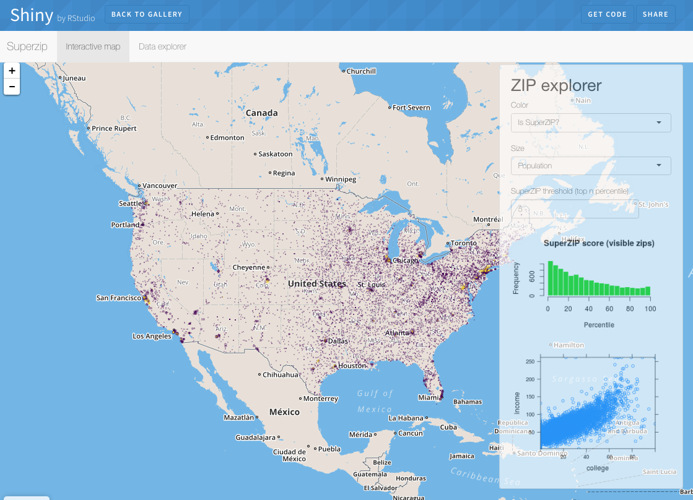

```{r setup, include=FALSE}
knitr::opts_chunk$set(eval = FALSE)
```

# Using R in hydrology (EGU2017 short course)

These slides and all other course materials can be found at:

<font size="6">[github.com/brry/rhydro](https://github.com/brry/rhydro)</font> 
<font size="4">#slides</font>   

To get all the material including the datasets and presentation source code, we recommend to
[download the whole github course repository](https://github.com/brry/rhydro/archive/master.zip).

This is an [R Markdown Notebook](http://rmarkdown.rstudio.com/r_notebooks.html).  
For discussions, please visit the 
[Hydrology in R Facebook group](https://www.facebook.com/groups/1130214777123909/).  
Before running the code blocks below, we suggest to get package installation instructions by running:
```R
source("https://raw.githubusercontent.com/brry/rhydro/master/checkpc.R")
```

\

**Aim and contents of this workshop**

We want to:  

* Show off how awesome R is for hydrology (it's R-some!^^)  
* Convince you to start or continue using R  
* Provide all the code for you as a starting point

We can not:  

* Teach you actual R coding (90 mins is too short for a tutorial)

We have prepared:

* [Good coding practice, report generation](#report) (Rstudio, `rmarkdown`, R notebook)
* [Using R as GIS](#gis) (reading a rainfall shapefile + Kriging, `sf` + `leaflet` + `mapview` + `OSMscale`)
* [River discharge time-series](#discharge) visualisation and extreme value statistics (`animation` + `extremeStat`)
* [Hydrological modelling](#hydmod) with `airGR`
* [Exploratory Data Analysis](#eda) including flow duration curve and trend analysis on time-series

\ 

Before we get started, please let us know your current R knowledge level by filling out the short survey at  
<font size="6">[bit.ly/knowR](https://bit.ly/knowR)</font> 

\

[top](#top)

# Report
Good coding practice, [report generation](#report) (Rstudio, `rmarkdown`, R notebook)  
**Daniel Klotz**

## Introduction


### Why I use R

Why I did not use: 


Whats great about R: 
```{r}
  library(ggplot2)
  test_data <- mpg
  test_plot <- ggplot(test_data, aes(displ, hwy, colour = class)) + 
    geom_point()
  test_plot
```

Why I decided to use R: 


Previously:
```{r}
  aggregation_function <- function(x) {
    round(mean(x),2)
  }
  mtcars_subset <- subset(mtcars,hp > 100)
  mtcars_aggregated <- aggregate(. ~ cyl, data = mtcars_subset, FUN = aggregation_function)
  car_data1 <- transform(mtcars_aggregated, kpl = mpg*0.4251)
  print(car_data1)
```

Now:
```{r}
library(magrittr)
car_data2 <- 
  mtcars %>%
  subset(hp > 100) %>%
  aggregate(. ~ cyl, data = ., FUN = . %>% mean %>% round(2)) %>%
  transform(kpl = mpg %>% multiply_by(0.4251)) %>%
  print
```


**btw:**
You can integrate other programming languages with ease. Here an example from 
[Yihui Xie](https://yihui.name/knitr/demo/engines/) for the use of `Fortran` 
in Rmarkdown:

1. Compile Code:
    ```{r compfort, engine='fortran', results='hide', eval=FALSE}
    C Fortran test
          subroutine fexp(n, x)
          double precision x
    C  output
          integer n, i
    C  input value
          do 10 i=1,n
             x=dexp(dcos(dsin(dble(float(i)))))
      10  continue
          return
          end
    ```

2. Run Code:
    ```{r testfort, collapse=TRUE, eval = FALSE}
    res = .Fortran("fexp", n=100000L, x=0)
    str(res)
    ```

Be happy with the result: 
>     `## List of 2`
>     `##  $ n: int 100000`
>     `##  $ x: num 2.72`

---

## Markdown 
HT**M**L: HyperText **Markdown** Language

John Gruber:

[](https://en.wikipedia.org/wiki/John_Gruber)


Comparison: Markdown vs. Latex 
[](https://youtu.be/2yvW0O_7xOg)


Rstudio provides cheat-sheets with the most important informations about many 
of their "favorite" packages & software:

[](https://www.rstudio.com/resources/cheatsheets/)

# Rmarkdown
In Rstudio: 

<div align="center">
  
</div>

<div align="center">
  
</div>

<div align="center">
  
</div>

"Native" Formats:

- [html](daniel/show/Rmark.html) 
- [pdf](daniel/show/Rmark.pdf) 
- [word](daniel/show/Rmark.docs)

Much more possible if you adress pandoc directly: 
[](http://pandoc.org/)

Information in the text can be automatically updated with the rest of the 
document:
[

### Examples

#### Small Websites
<div align="center">
  <a href = "http://rstudio.github.io/tufte/">
    
  </a>
</div>

<div align="center">
  <a href = "http://yixuan.cos.name/prettydoc/cayman.html">
    
  </a>
</div>

#### Books (blogdown)
[](https://bookdown.org/)
[](https://bookdown.org/)

### Blogs (hugo)
[](https://bookdown.org/yihui/blogdown/)

#### Widgets 
[](https://gallery.shinyapps.io/cran-gauge/)
[](https://shiny.rstudio.com/gallery/superzip-example.html)

#### Presentations
[](http://rmarkdown.rstudio.com/revealjs_presentation_format.html)

#### Apps (Shiny) 
[](https://shiny.rstudio.com/)
[](https://shiny.rstudio.com/gallery/superzip-example.html)


\
[top](#top)

# GIS
Using R as GIS (reading a rainfall shapefile + Kriging, `sf` + `leaflet` + `mapview` + `OSMscale`)  
**Berry Boessenkool**

### Shapefiles

Reading shapefiles with `maptools::readShapeSpatial` and `rgdal::readOGR` is obsolete.  
Instead, use `sf::st_read`. `sf` is on CRAN since oct 2016.  
Main reaction when using sf: "Wow, that is fast!"  
[Download the shapefile](https://minhaskamal.github.io/DownGit/#/home?url=https://github.com/brry/rhydro/tree/master/presentations/data/PrecBrandenburg) 
or better: [download the whole github course repository](https://github.com/brry/rhydro/archive/master.zip)

```{r}
rain <- sf::st_read("data/PrecBrandenburg/niederschlag.shp")
centroids <- sf::st_centroid(rain)
centroids <- sf::st_coordinates(centroids)
```

[top](#top)

### Plotting, maps

Static plot:
```{r}
plot(rain[,1])
```

Static map:
```{r}
prj <- sf::st_crs(rain)$proj4string
centroids <- as.data.frame(centroids)
cent_ll <- OSMscale::projectPoints(Y,X, data=centroids, to=OSMscale::pll(), from=prj)
map_static <- OSMscale::pointsMap(y,x, cent_ll, fx=0.08, type="maptoolkit-topo", zoom=6)
```

Interactive map:
```{r}
library(leaflet)
cent_ll$info <- paste0(sample(letters,nrow(cent_ll),TRUE), ", ", round(cent_ll$x,2), 
                       ", ", round(cent_ll$y,2))
leaflet(cent_ll) %>% addTiles() %>% addCircleMarkers(lng=~x, lat=~y, popup=~info)
```

Interactive map of shapefile:
```{r}
# devtools::install_github("environmentalinformatics-marburg/mapview", ref = "develop")
library(berryFunctions) # classify, seqPal
col <- seqPal(n=100, colors=c("red","yellow","blue"))[classify(rain$P1)$index]
mapview::mapview(rain, col.regions=col)
```

[top](#top)

### Kriging

Plot original points colored by third dimension:
```{r}
pcol <- colorRampPalette(c("red","yellow","blue"))(50)
x <- centroids$X # use cent_ll$x for projected data
y <- centroids$Y
berryFunctions::colPoints(x, y, rain$P1, add=FALSE, col=pcol)
```

Calculate the variogram and fit a semivariance curve
```{r}
library(geoR)
geoprec <- as.geodata(cbind(x,y,rain$P1))
vario <- variog(geoprec, max.dist=130000) # other maxdist for lat-lon data
fit <- variofit(vario)
plot(vario)
lines(fit)
```

Determine a useful resolution 
(keep in mind that computing time rises exponentially with grid size)
```{r}
# distance to closest other point:
d <- sapply(1:length(x), function(i)
            min(berryFunctions::distance(x[i], y[i], x[-i], y[-i])) )
# for lat-long data use (2017-Apr only available in github version of OSMscale)
# d <- OSMscale::maxEarthDist(y,x, data=cent_ll, fun=min)
hist(d/1000, breaks=20, main="distance to closest gauge [km]")
mean(d/1000) # 8 km
```

Perform kriging on a grid with that resolution 
```{r}
res <- 1000 # 1 km, since stations are 8 km apart on average
grid <- expand.grid(seq(min(x),max(x),res),
                    seq(min(y),max(y),res))
krico <- krige.control(type.krige="OK", obj.model=fit)
#krobj <- krige.conv(geoprec, loc=grid, krige=krico)
#save(krobj, file="data/krobj.Rdata")
load("data/krobj.Rdata") # line above is too slow for recreation each time
```

Plot the interpolated values with \rcode{image} or an equivalent 
(see [Rclick](https://github.com/brry/rclick) 4.15) and add contour lines.
```{r}
par(mar=c(0,3,0,3))
geoR:::image.kriging(krobj, col=pcol)
colPoints(x, y, rain$P1, col=pcol, legargs=list(horiz=F, title="Prec",y1=0.1,x1=0.9))
points(x,y)
plot(rain, col=NA, add=TRUE)
```

\
[top](#top)

# Discharge
River discharge time-series visualisation and extreme value statistics (`animation` + `extremeStat`)  
**Berry Boessenkool**

\
[top](#top)

# Hydmod
Hydrological modelling with `airGR`   
**Katie Smith**

\
[top](#top)

# EDA
Exploratory Data Analysis including flow duration curve and trend analysis on time-series   
**Shaun Harrigan**

\
[top](#top)


# Discussion

Please give us feedback at
<font size="6">[bit.ly/feedbackR](https://bit.ly/feedbackR)</font> 

For discussions, please use the 
[Hydrology in R Facebook group](https://www.facebook.com/groups/1130214777123909/).  

